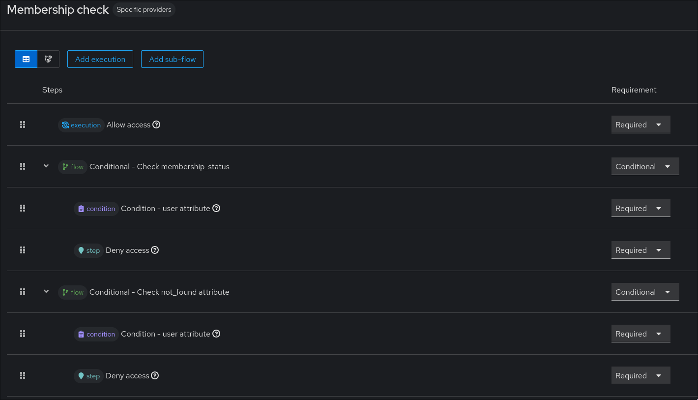

# Keycloak Build for W.I.S.V. 'Christiaan Huygens'

This project contains everything you need to setup the Keycloak instance for authentication and authorization via OIDC
for our study association.

## What do the custom providers provide?

Our custom providers allow us to add claims from Google (Google groups) and Dienst (membership_status, contact details,
etc.) to users on login.

## Keycloak Setup

### Installation

First step is ensuring you have a Keycloak instance up and running. Please follow the following guides accordingly:

- https://www.keycloak.org/getting-started/getting-started-kube
- https://www.keycloak.org/server/configuration-production
- https://www.keycloak.org/documentation

### Realm creation

Once everything is set up, login by going to https://login.wisv.ch/admin. Start by creating a new realm. Please refrain
from using the master realm for production
purposes, as it should only be used for general management of Keycloak.

Let's walk through all the different configuration pages and configure them.

### Realm Settings

In the Realm Settings page, start by configuring the names and frontend UI on the General page. Then, ensure that '
User-managed access', 'Organizations' and 'Admin Permissions' are turned off. Disable 'Unmanaged attributes' as well in
case of a production environment.

On the Login page, ensure that all options are turned off.

No action is needed on the Email page.

On the Themes page, select 'chtheme' as the login theme. Dark mode should also be enabled (!).

Walk through the Keys, Events, Localization, Security Defenses, Sessions and Client policies pages. TODO define more
here?

On the User profile page, ensure the following list of attributes is set. No attribute should be editable (neither by
users or admins), but all attributes should be viewable. In the case of address, they can be combined into an attribute
group if wanted (same can be done for all scopes, but not necessary).

```
not_found
membership_status
name
preferred_name
given_name
family_name
gender
birthdate
email
phone_number
address.street_address
address.postal_code
address.locality
address.country
address.formatted
google_username
google_groups (multivalued)
netid
student_number
study
```

No action is needed on the user registration page.

### Authentication

Within the Authentication page, you can find the different flows, required actions and policies for your realm.

We will start by going to 'Required actions'. Ensure that ALL required actions are disabled.

Next up, we will go to 'Flows'. None of the built-in flows need to be changed, but we do need to create a new one, which
will ensure only authorized users are allowed access. In our case, this means we will check whether the Dienst and
Google groups lookup went correctly and we will ensure the membership status is valid.

For this, start by creating a new flow. Within this flow, start by adding the Allow access execution. Then create two
sub-flows, one for checking the not_found attribute and one for checking the membership_status.
Within both, create a condition for a user attribute. Then, add the deny access execution to both subflows. It should
end up as the following flowchart, see this image:



With that, the membership check flow should be complete and ready to go.

### Identity providers

Now we will add the two required identity providers. The setup will share a lot of the configuration.

#### SURFConext

Documentation:

- https://servicedesk.surf.nl/wiki/spaces/IAM/pages/128909938/Claims
- https://servicedesk.surf.nl/wiki/spaces/IAM/pages/128909841/OpenID+Connect+reference

Service Provider portal: https://sp.surfconext.nl. Login with beheer@ch.tudelft.nl via EduID. Create a new entity like
the ones already there. Be sure to save the client ID and secret, and setup the identity
provider as an OpenID Connect provider in Keycloak.

For the Advanced settings, ensure that 'Trust Email' is turned on, but everything else is turned off. The post login
flow should be your newly created membership check flow. The sync mode should be 'Force'.

Then, go to Mappers, and create a new SurfConext Claim mapper. Configure the dienst2 parameters, and ensure the sync
mode override is again set to 'Force'. With this, the SURFconext IdP should be ready to go.

#### Google

Documentation:

- https://developers.google.com/identity/protocols/oauth2
- https://console.cloud.google.com/apis/credentials?referrer=search&project=wisvch

Create a new OAuth client in Cloud Console, and save the client ID and secret. Again create a new identity provider like
above, ensuring that you switch out the mapper with the google claim mapper. Then this IdP should also be ready to go.

### Client scopes
On the Client scopes page, ensure the following scopes are setup:
```
openid:
- sub

profile:
- name
- preferred_username
- given_name
- familty_name
- middle_name
- nickname
- profile
- picture
- website
- gender
- zone_info
- locale
- updated_at
- birthdate

email:
- email
- email_verified

phone:
- phone_number
- phone_number_verified

address:
- address.formatted
- address.street_address
- address.locality
- address.region
- address.postal_code
- address.country

auth:
- google_username
- google_groups

student:
- netid
- student_number
- study
```

With that done, you should be ready to go!

## Resources

- https://www.keycloak.org/docs/latest/server_development/index.html#_providers
- https://github.com/keycloak/keycloak-quickstarts/
- https://medium.com/@djordjev9/customizing-keycloak-part-1-extending-keycloak-with-user-federation-1633238d8ff5
- https://www.keycloak.org/docs-api/latest/javadocs/index.html

